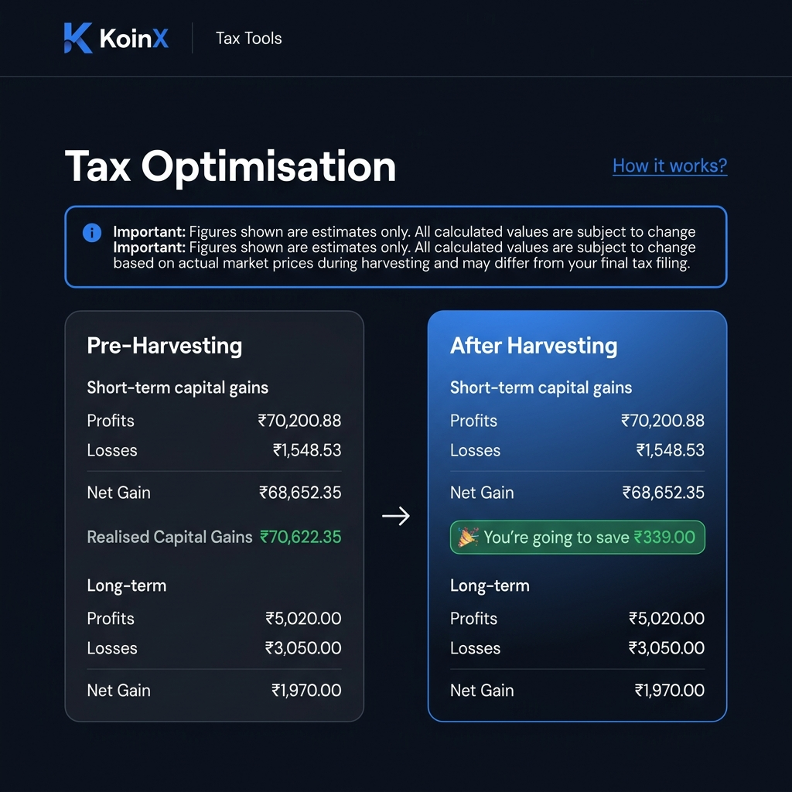
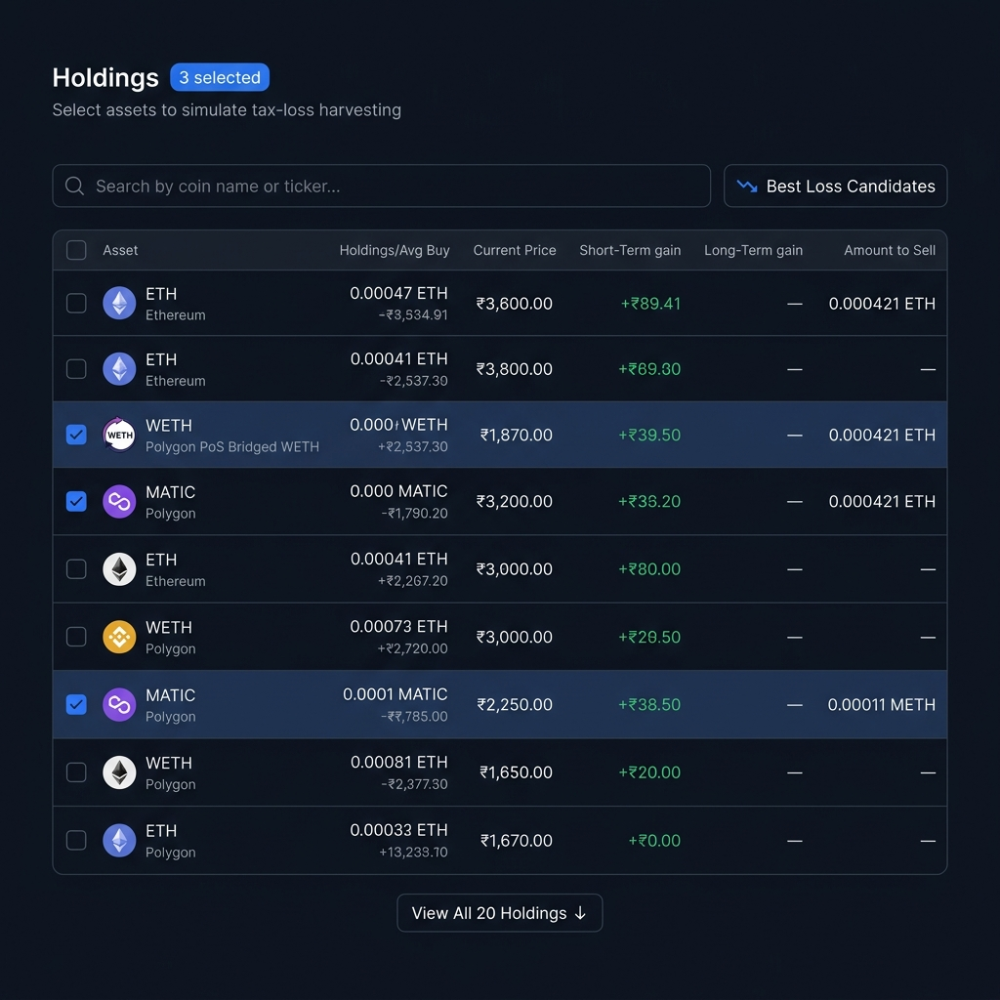

# Tax-Loss-Harvesting

A responsive React application for simulating **tax loss harvesting** on crypto holdings. Select assets, watch capital gains recalculate in real time, and see your potential tax savings instantly.

Built as part of the **KoinX Frontend Intern Assignment**.

---

## 📸 Screenshots

### Dashboard — Capital Gains Cards


### Holdings Table — Select & Simulate


---

## 🔧 Setup Instructions

### Prerequisites
- **Node.js** v18+ and **npm** installed

### Local Development

```bash
# 1. Clone the repo
git clone https://github.com/Ayushsharma0480A/Tax-Loss-Harvesting.git
cd Tax-Loss-Harvesting

# 2. Install dependencies
npm install

# 3. Start the dev server
npm start
# App opens at http://localhost:3000
```

### Production Build

```bash
npm run build
# Output in /build — ready to deploy
```

### Deploy to Vercel

```bash
npm install -g vercel
vercel --prod
```

Or connect your GitHub repo at [vercel.com/new](https://vercel.com/new) — zero config needed.

---

## 🚀 Live Demo

**[https://tax-loss-harvesting-koinx-ayush.netlify.app](https://tax-loss-harvesting-koinx-ayush.netlify.app)**

---

## ✨ Features

- **Pre-Harvesting & After-Harvesting cards** — real-time capital gains computation
- **Interactive Holdings Table** with sortable columns and real-time search filter
- **Select / Deselect All** checkbox with indeterminate state support
- **Savings banner** — appears only when harvesting actually reduces tax liability
- **"Best Loss Candidates" toggle** — surfaces assets with largest unrealised losses
- **Amount to Sell** — shows quantity with coin ticker when selected (e.g. `0.000421 ETH`)
- **"How it works?" tooltip** — hover for step-by-step instructions
- **View All / Show Less** toggle beyond the default 5 rows
- **Skeleton loaders** with shimmer animation during API fetch
- **Error screen** with retry action
- **Fully responsive** — mobile, tablet, and desktop

---

## 🏗️ Folder Structure

```
src/
├── api/
│   └── mockApi.js            # Mock API with simulated delays (800ms / 600ms)
├── components/
│   ├── CapitalGainsCard.jsx   # Reusable Pre/After harvesting card
│   └── HoldingsTable.jsx      # Holdings table with checkboxes, search, sort
├── hooks/
│   └── useHarvestingData.js   # All state, business logic, derived computation
├── utils/
│   └── formatters.js          # Currency (₹), number, and price formatters
├── App.js                     # Root layout & page composition
├── App.css                    # Design system via CSS variables
└── index.js                   # ReactDOM entry point
```

---

## 🧠 Business Logic

### Capital Gains Formula

```
Net STCG     = stcg.profits − stcg.losses
Net LTCG     = ltcg.profits − ltcg.losses
Realised CG  = Net STCG + Net LTCG
```

### After-Harvesting (on selecting a holding)

For each selected asset:
- If `stcg.gain > 0` → added to `stcg.profits`
- If `stcg.gain < 0` → absolute value added to `stcg.losses`
- Same logic applies for `ltcg.gain`

### Savings

```
if (preRealised > postRealised) → show "You're going to save ₹X"
```

---

## ⚙️ Tech Stack

| Layer            | Choice                                              |
| ---------------- | --------------------------------------------------- |
| Framework        | React 18                                            |
| Styling          | Vanilla CSS with custom design system (CSS vars)    |
| State Management | `useState`, `useEffect`, `useMemo`, `useCallback`   |
| API Mocking      | In-app Promises with `setTimeout` simulated delays   |
| Fonts            | Syne (headings) + DM Sans (body) via Google Fonts   |

---

## 📝 Assumptions

1. **Holdings identified by original array index** — the same coin (e.g. USDC) can appear multiple times from different networks, so array index is used as unique identifier instead of coin symbol.
2. **Default sorting** — Holdings are sorted by total gain (STCG + LTCG) descending, showing assets with the most harvesting potential first.
3. **"View All" default** — Shows the top 5 holdings initially; click "View All" to see all 20.
4. **"Amount to Sell"** — Shows `totalHolding` with coin ticker (e.g. `0.000421 ETH`) when selected, and a dash (`—`) when unselected.
5. **Savings displayed conditionally** — Only shown when post-harvesting realised gains are **strictly less than** pre-harvesting, not when equal.
6. **Microscopic values** — Gains smaller than `1e-10` display as `~0`; values below `0.001` use scientific notation for precision.
7. **No real backend** — All data is mocked via `mockApi.js` with realistic delays; trivially replaceable with real `fetch` calls later.
8. **Currency** — All values displayed in Indian Rupees (₹) with Indian numbering system (L = Lakh, Cr = Crore).

---

## 📄 License

MIT
